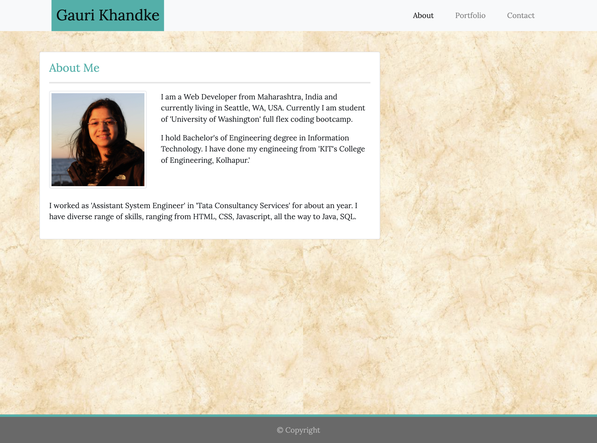

# Responsive Portfolio

## Goal : 

* Create responsive portfolio using Bootstrap CSS framework.

## Motivation :

#### Responsive Web Design:

* Responsive design ensures that web applications render well on a variety of devices and window or screen sizes.
* It is the approach that suggests that design and development should respond to the user’s behavior and environment based on screen size, platform and orientation.
* The practice consists of a mix of flexible grids and layouts, images and an intelligent use of CSS media queries.
* As the user switches from their laptop to iPad, the website should automatically switch to accommodate for resolution, image size and scripting abilities. 
* RWD is about using HTML and CSS to automatically resize, hide, shrink, or enlarge, a website, to make it look good on all devices (desktops, tablets, and phones).

## Screenshots : 
|Medium Devices/ Laptop|Small Devices/ Tablet|Extra Small Devices/Phone
|--|--|--
||| 


## Tech/ Framework used :

### Bootstrap : 

* Bootstrap is a free and open-source CSS framework directed at responsive, mobile-first front-end web development. It contains CSS and (optionally) JavaScript-based design templates for typography, forms, buttons, navigation, and other interface components.

#### Steps to include bootstrap to your project: 
1. Add Meta tag into your HTML page inside head tag:  
```
<meta name="viewport" content="width=device-width, initial-scale=1.0, shrink-to-fit=no">
```

2. Add link to bootstrap CSS in head tag of your HTML page :
```
<link rel="stylesheet" href="https://stackpath.bootstrapcdn.com/bootstrap/4.5.0/css/bootstrap.min.css" integrity="sha384-9aIt2nRpC12Uk9gS9baDl411NQApFmC26EwAOH8WgZl5MYYxFfc+NcPb1dKGj7Sk" crossorigin="anonymous">
```

3. Add jQuery and popper.js files at the end of your HTML body.
* jQuery: 
```
<script src="https://code.jquery.com/jquery-3.5.1.slim.min.js" integrity="sha384-DfXdz2htPH0lsSSs5nCTpuj/zy4C+OGpamoFVy38MVBnE+IbbVYUew+OrCXaRkfj" crossorigin="anonymous"></script>
```  
* popper.js:
```     
<script src="https://cdn.jsdelivr.net/npm/popper.js@1.16.0/dist/umd/popper.min.js" integrity="sha384-Q6E9RHvbIyZFJoft+2mJbHaEWldlvI9IOYy5n3zV9zzTtmI3UksdQRVvoxMfooAo" crossorigin="anonymous"></script>
```
4. Add components from bootstrap website in your project and customize it as per your requirement.
        
## Features :

1. **Responsive Web Design**

2. **Bootstrap grid layout :** Bootstrap's grid system is built with flexbox and allows up to 12 columns across the page. The grid system is responsive, and the columns will re-arrange automatically depending on the screen size. 
The Bootstrap 4 grid system has five classes: 
  * `.col-` : extra small devices - screen width less than 576px
  * `.col-sm-` : small devices - screen width equal to or greater than 576px
  * `.col-md-` : medium devices - screen width equal to or greater than 768px
  * `.col-lg-` : large devices - screen width equal to or greater than 992px
  * `.col-xl-` : xlarge devices - screen width equal to or greater than 1200px
The classes above can be combined to create more dynamic and flexible layouts.

3. **Responsive images :** Responsive images automatically adjust to fit the size of the screen.
Create responsive images by adding an `.img-fluid` class to the `` tag. The image will then scale nicely to the parent element.

4. **HTML Validation Service :**  
  * Test or validate your HTML code against the formal guidelines and standards set by the World Wide Web Consortium (W3C) for HTML/XHTML web pages.
  * The World Wide Web Consortium provide a simple online tool [HTML validator](https://validator.w3.org/) that automatically check your HTML code and point out any problems/errors your code might have, such as missing closing tags or missing quotes around attributes.
  * There are several specific reasons for validating a web page, some of them are:
    * It helps to create web pages that are cross-browser, cross-platform compatible. It also likely to be compatible with the future version of web browsers and web standards.
    * Standards compliant web pages increase the search engine spiders and crawlers visibility, as a result your web pages will more likely be appear in search results.
    * It will reduce unexpected errors and make your web pages more accessible to the visitor.

5. **Semantic HTML :**
  * Semantic HTML refers to syntax that makes the HTML more comprehensible by better defining the different sections and layout of web pages. It makes web pages more informative and adaptable, allowing browsers and search engines to better interpret content.
  * Semantic HTML or semantic markup is HTML that introduces meaning to the web page rather than just presentation.
  * Semantically correct HTML helps search engines, screen readers, and other user devices determine the significance and context of web content.
  * Semantic HTML tags are self descriptive.


## Deployed Website :

* https://gaurikhandke.github.io/responsive-portfolio/
